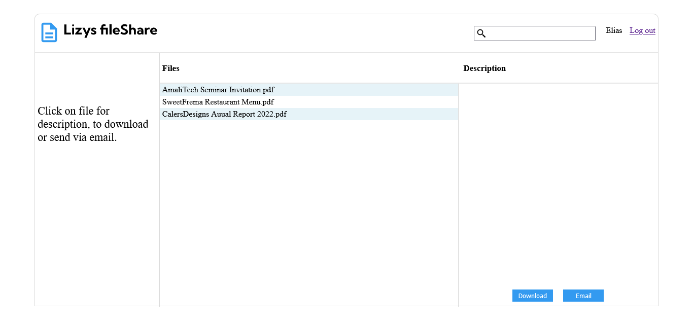

# File Server

This is a Node.js Express and PostgreSQL application which serves files to the user. 

## Table of contents

- [Overview](#overview)
  - [The challenge](#the-challenge)
  - [Screenshot](#screenshot)
  - [Links](#links)
- [My process](#my-process)
  - [Built with](#built-with)
  - [What I learned](#what-i-learned)
  - [Continued development](#continued-development)
  - [Useful resources](#useful-resources)
- [Author](#author)
- [Acknowledgments](#acknowledgments)

## Overview

### The challenge

Users should be able to:

- Signup & log in with an email and password with account verification and password-reset feature

- See a feed page that contains a list of the files that can be downloaded or sent via email

- Search the file server

The Admin should be able to:

- Upload files with a title and description

- See the number of downloads and number of emails sent for each file

### Screenshot

### Links

- Solution URL: [Github Repository](https://github.com/eliasonic/File-server-)
- Live App URL: [File Server](https://file-server-wxuq.onrender.com)

## My process

### Built with

- Front-end: HTML, CSS, JavaScript

- Back-end: Node.js Express, PostgreSQL 

### What I learned

- How to use the Express server framework 

- How to implement modules in Node.js

- How to perform CRUD operations on postgreSQL database  
- How to build REST APIs and use the MVC architecture
- How to make HTTP requests

### Continued development

- In the future, I will include additional features to the app and improve upon the user experience.

- I also plan to use TypeScript for my next Node.js project.

### Useful resources

The following courses on Codecademy were helpful in completing this project:

- [Backend Programming with Node](https://www.codecademy.com/learn/backend-programming-with-node)
- [Design Databases With PostgreSQL](https://www.codecademy.com/learn/paths/design-databases-with-postgresql)
- [Connecting Front-End to Back-End](https://www.codecademy.com/learn/connecting-front-end-to-back-end)

## Author

- LinkedIn - [Elias Adjetey](https://www.linkedin.com/in/elias-adjetey-98522686/)
- Github - [@eliasonic](https://github.com/eliasonic)
- Twitter - [@eliasonic](https://twitter.com/eliasonic)

## Acknowledgments

- Thanks to the Almighty God for seeing me through this project. 

- Special thanks to [AmaliTech](https://amalitech.org) for providing the training and mentorship for this project.

- Credit to my mentor, [Mr Thomas Darko](mailto:thomas.darko@amalitech.org) for the constant motivation and insights into intricate aspects of the project. 

